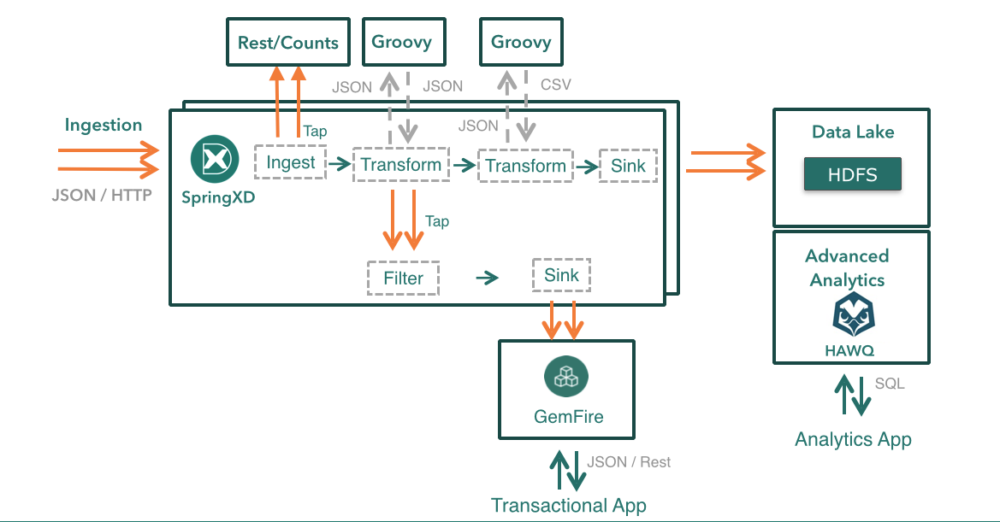
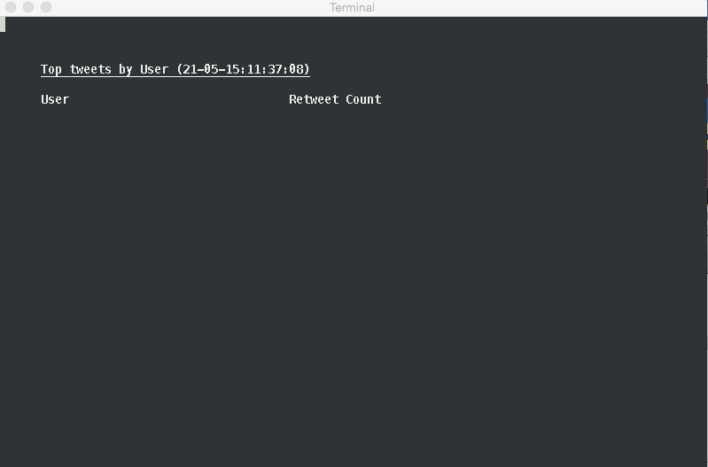
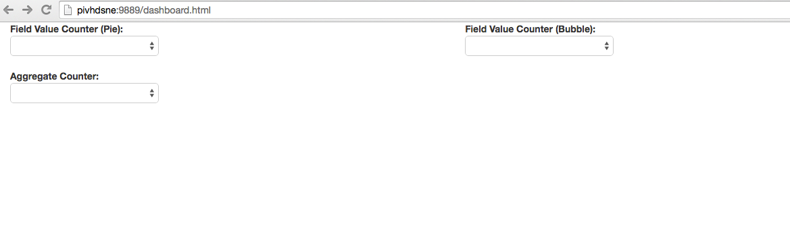
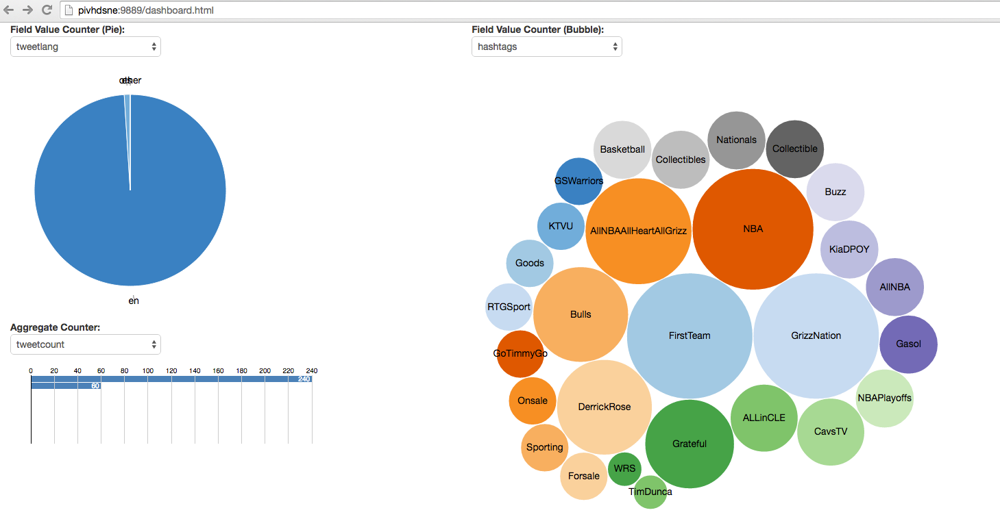
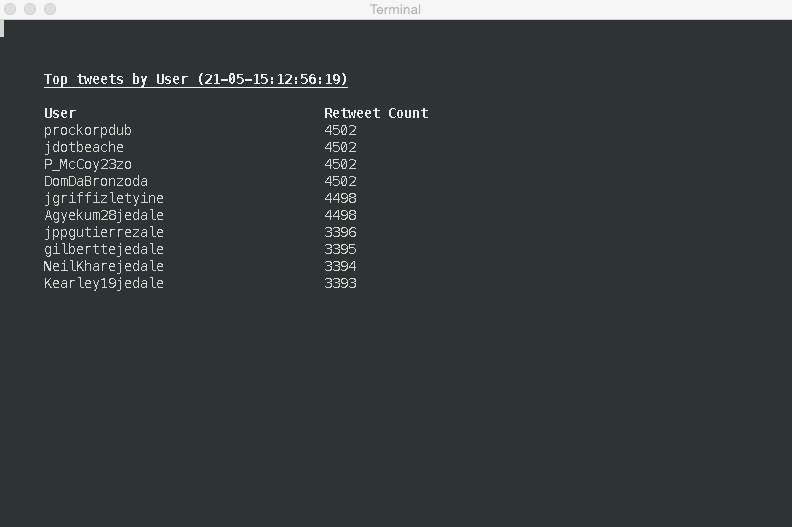
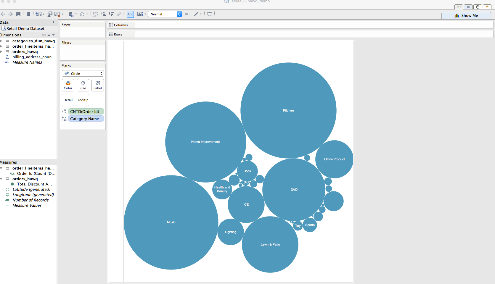

== DEMO 1 - BDS Integration Demo

The goal of this demo is to show components of the BDS integrating together.  Namely PHD, HAWQ, Spring XD and GemFire.

=== Step 1: Pull data from twitter

See what is trending at twitter.com first and plug that in as the query parameter.

Define the streams through the Spring XD Shell

----
$ stream create --name tweet --definition "twittersearch --query='HowIBecameAFan' --outputType=application/json | flatten: transform --script=tweets-search.groovy --inputType=application/json | csv: transform --script=csv.groovy --inputType=application/json | hdfs --rollover=1K --directory=/tweet-data"
----

=== Step 2: Set up analytic taps
----
$ stream create tweetlang  --definition "tap:stream:tweet > field-value-counter --fieldName=lang" --deploy
$ stream create tweetcount --definition "tap:stream:tweet > aggregate-counter" --deploy
$ stream create hashtags --definition "tap:stream:tweet > field-value-counter --fieldName=entities.hashtags.text --name=hashtags" --deploy
----

=== Step 3: Pull the most popular tweets into GemFire
----
stream create gemfireTap --definition "tap:stream:tweet.flatten > filter --expression=!(T(java.lang.Integer).parseInt(#jsonPath(payload,'$.retweet_count'))<1) | gemfire-json-server --useLocator=true --host=pivhdsne --port=10334 --regionName=tweet --keyExpression=payload.getField('id')" --deploy
----

=== Step 4: Setup the analytic dashboard web application

Use the _Web Server_ tab in your terminal group to do this:
[source,bash]
----
$ cd spring-xd-samples/analytics-dashboard/
----
Then start webserver
[source,bash]
----
$ ./startWebServer.sh
----
You now have an application listening at: http://pivhdsne:9889/dashboard.html

=== Step 5: Start the TopTweetsByUserQuery GemFire Application from STS

This application will connect to GemFire grid running in your pivhdsne VM.

This application uses OQL to find the most popular tweets.

In STS run the class:

[source,java]
----
com.pivotal.twitter.TopTweetsByUserQuery
----

=== Step 6: Review environment before activating pipeline

Review HDFS (should be empty):
----
$ hdfs -dfs -ls /tweet-data
----

Review the TopTweetsByUserQuery application.

Should show no data in terminal window:

Review Spring XD Analytic Dashboard (should be empty):

=== Step 7: Deploy tweet stream

Once the tweet stream is deployed then then the data pipeline will become active.

Data will be landing in GemFire, HDFS and dash boards will start to populate.
[source,bash]
----
$ stream deploy tweet
----

=== Step 8: Show the effects of the data pipeline

Review HDFS (should be filling up with files):
----
$ hdfs -dfs -ls /tweet-data
----

Review the Spring XD analytic dashboard in your local browser:
Note that there are counts for:
* aggregate # of tweets
* languages
* hash tags

----
http://pivhdsne:9889/dashboard.html
----

Review the TopTweetsByUserQuery application.

It should be populating with data.

Demo the GemFire Restful API.  Great for transactional applications and is language agnostic.
----
$ curl -i http://pivhdsne:7576/gemfire-api/v1/tweet?limit=1
----

Examine all the data with HAWQ:

This table should already be created for you..
[source,sql]
----
CREATE external TABLE tweet_pxf(
   id VARCHAR(255), from_user VARCHAR(255), created_at VARCHAR(255), text VARCHAR(255),
   language_code VARCHAR(10), retweet_count INTEGER)
   location ('pxf://pivhdsne:50070/tweet-data/tweet-*.txt?profile=HdfsTextSimple')
  FORMAT 'CSV' LOG ERRORS INTO tweet_err SEGMENT REJECT LIMIT 1000;
----

Different queries can be run to show ANSI SQL compliance:
[source,sql]
----
select from_user, sum(retweet_count) as total  from tweet_pxf group by from_user order by total desc limit 10 ;

select distinct from_user, retweet_count from tweet_pxf order by retweet_count desc, from_user desc;
----

== DEMO 2 - Performance Spectrum: Map Reduce vs HAWQ
This demo shows solving the analytic problem different ways.  The goal is to find top tax paid by postal code.  The customer will see a spectrum of possibilities, but if speed is most important it is clear HAWQ is the best.

To run the M/R job, go to the following directory.  Do this in the _M/R Example_ tab of your terminal group:
----
$ cd  /pivotal-samples/map-reduce-java/taxpaid_by_postalcode
----

Show off attributes about the file:
----
$ hdfs dfs -cat /retail_demo/orders/orders.tsv.gz | zcat | more
$ hdfs dfs -cat /retail_demo/orders/orders.tsv.gz | zcat | wc -l
$ hdfs dfs -ls /retail_demo/orders/orders.tsv.gz
----

Time M/R job (take note of how long it takes):
[source,bash]
----
$ time hadoop jar target/taxpaid_by_postalcode-1.0.jar com.pivotal.hadoop.PostalCodesPaidAmountTaxDriver /retail_demo/orders/orders.tsv.gz /output-mr1
----

Review the output:
----
$ hdfs dfs -cat /output-mr1/part-r-00000
----
Now move to the _HAWQ_ tab of your terminal group.  Start the psql client:
----
$ psql
$ \timing
----

Solve the same problem with HAWQ external tables:
[source,sql]
----
select billing_address_postal_code, sum(total_paid_amount::float8) as total, sum(total_tax_amount::float8) as tax from retail_demo.orders_pxf group by billing_address_postal_code order by total desc limit 10;
----

Solve the same problem with Hawq tables:
[source,sql]
----
select billing_address_postal_code, sum(total_paid_amount::float8) as total, sum(total_tax_amount::float8) as tax from retail_demo.orders_hawq group by billing_address_postal_code order by total desc limit 10;
----

=== DEMO 3 - Predictive Analytics Using MadLib (Linear Regression)

View the data; predict house prices based on tax, bathroom and size:
[source,sql]
----
select * from houses;
----

Train the regression model:

[source,sql]
----
SELECT madlib.linregr_train( 'houses',
  'houses_linregr',
  'price',
  'ARRAY[1, tax, bath, size]'
);
----
Examine the results:

[source,sql]
----
\x ON
SELECT * FROM houses_linregr;
\x OFF
----

Predict the price:
[source,sql]
----
SELECT houses.*,
madlib.linregr_predict( ARRAY[1,tax,bath,size],
  m.coef
) as predict,
price -
madlib.linregr_predict( ARRAY[1,tax,bath,size],
  m.coef
) as residual
FROM houses, houses_linregr m;
----

=== DEMO 4 - Integration with 3rd Party tool (Tableau)

Visualize data with Tableau:

