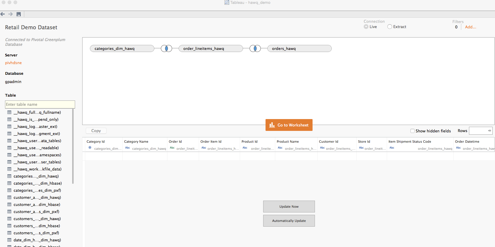
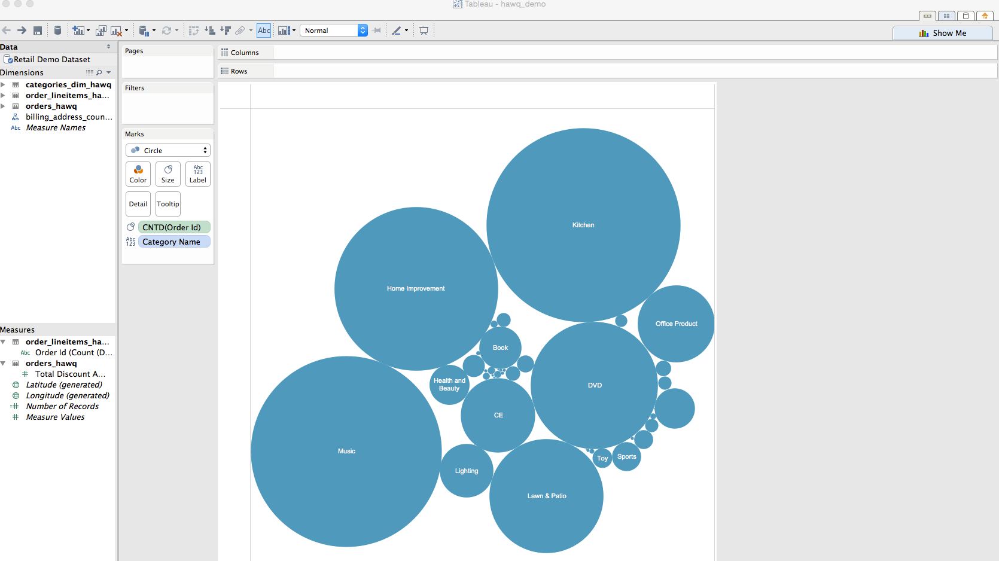
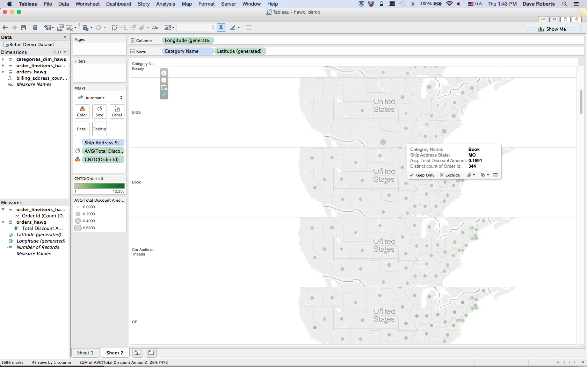

= DEMO ENVIRONMENT

* PHD 2.1 with GemFire and HAWQ
* Spring XD version 1.0.2
* 8GB of Memory and 4 cores configured for the VM

= SETUP
Follow the following steps to create a portable demo envionment on your laptop:

== 1 - Confirm VM Configuration Settings
Make certain that you have 8GB of Memory and 4 cores configured for the VM

== 2 - Assign VM a Static IP Address

Generally speaking, it is advantageous to demo outside of the VM.  For that reason, you will need to assign your PHD VM a static IP address.

Please follow these link:http://socalledgeek.com/blog/2012/8/23/fixed-dhcp-ip-allocation-in-vmware-fusion[directions].

Note that your subnet may be different from the one mentioned in the article.  For instance, mine starts with 172.16.111.0 as opposed to 192.168.247.0.

Also make sure that the IP address that you assign is outside of the range used by fusion.  You can find the range used close to the top of the file.

In most cases, restarting Fusion is enough, but if you don't get an IPv4 IP address then also reboot your machine.

== 3 - Edit VM Hosts File

Edit the hosts file on the VM and make certain that the following host names resolve to your new static IP address:
----
172.16.111.53   pivhdsne pivhdsne.localdomain
----
== 4 - Edit Local Hosts File

Edit the hosts file on your host and make certain that the following host names resolve to your new static IP address:
----
172.16.111.53   pivhdsne pivhdsne.localdomain
----

== 5 - Setup Twitter Keys

Most of the demonstrations use twitter apis to ingest data.

You will need to setup an app at the twitter link:https://apps.twitter.com/[developer site]:

You will need the following

* consumerKey
* consumerSecret
* accessToken
* accessTokenSecret

You will then populate these values in the following files in the pivhdsne vm:
----
~/spring-xd-1.0.2.RELEASE/xd/config/modules/source/twittersearch/twittersearch.properties
~/spring-xd-1.0.2.RELEASE/xd/config/modules/source/twitterstream/twitterstream.properties
----

== 6 - Import TopTweetsByUserQuery Project into STS

TopTweetsByUserQuery is a GemFire client application.

. Install link:https://spring.io/tools/sts/all[STS]
. Clone this project if you haven't
. Import Maven Project
. Browse to TopTweetsByUserQuery directory

== 8 - Import Terminal Group

You will need a lot of terminal windows to make the demos seamless.  To make managing them easier we will use Terminal Windows groups.

Import the Windows group into Terminal - this is the pivhdsne.terminal file.

Mac:
Create host-specific key and store in standard location
----
$ ssh-keygen -t rsa -f ~/.ssh/gpadmin_pivhdsne
----

Mac:
Copy key to remote host (no ssh-copy-id on macs)
----
$ cat ~/.ssh/gpadmin_pivhdsne.pub | ssh gpadmin@pivhdsne 'cat >> ~/.ssh/authorized_keys'
----

Follow these directions for link:http://drewsymo.com/2013/11/how-to-create-an-ssh-config-file-shortcut-on-mac-osx-linux/passwordless[passwordless SSH].  Don't forget the IdentityFile line.
Mine is: ~/.ssh/gpadmin_pivhdsne

== 9 - Start Terminal Group and Services (repeated each demo)
Start the Terminal Windows Group.  You should ssh right into the VM.

*Note that these are steps you will repeat each time you demo.*

=== Start PHD, HAWQ, and GemFire

Using the _admin_ tab in your terminal group start most services at (PHD, GF, HAWQ):
[source,bash]
----
$ ~/Desktop/start_all.sh
----

When done use the following to stop
[source,bash]
----
$ ~/Desktop/stop_all.sh
----

=== Start Spring XD
Use the _Spring XD Single Node_ tab in your terminal group.
[source,bash]
----
$ ~/spring-xd-1.0.2.RELEASE/xd/bin/xd-singlenode
----
Control + C will kill this process

=== Start Spring Shell (separate tab)
[source,bash]
----
$ ~/spring-xd-1.0.2.RELEASE/shell/bin/xd-shell
----

To exit shell
[source,bash]
----
$ exit
----

=== Startup the analytic dashboard web application

Use the _Web Server_ tab in your terminal group to do this:
[source,bash]
----
$ cd spring-xd-samples/analytics-dashboard/
----
Then start webserver
[source,bash]
----
./startWebServer.sh
----
You now have an Ruby web server listening at:
http://pivhdsne:9889/dashboard.html

Control + C will kill this process

== 10 - Install Tableau Locally

. Install link:https://www.tableau.com/products/desktop/download[Tableau Desktop]
. Install the link:http://www.tableau.com/support/drivers#mac-greenplum[Pivotal Greenplum Driver for Tableau]
. Get the license key from Dave
. Open the link:hawq_demo.twb[HAWQ Demo Workbook]

Dataset Configuration:

Order Items by Category:

Average Total Discount by Category and State:

