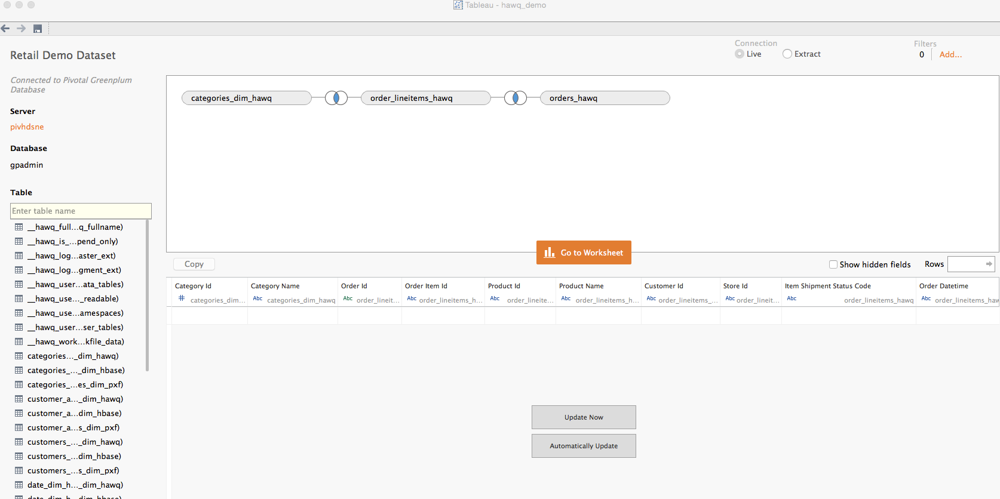
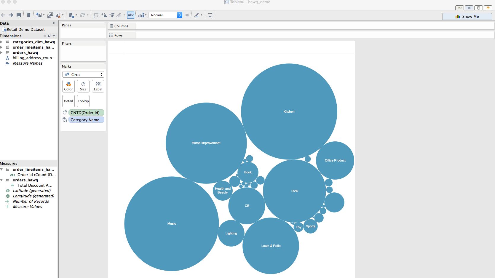
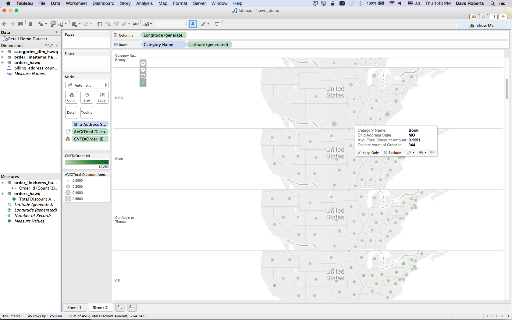

= DEMO ENVIRONMENT

* PHD 2.1 with GemFire and HAWQ
* Spring XD version 1.0.2
* 8GB of Memory and 4 cores configured for the VM

= SETUP
Follow the following steps to create a portable demo envionment on your laptop:

== 1 - Confirm VM Configuration Settings
Make certain that you have 8GB of Memory and 4 cores configured for the VM

== 2 - Assign VM a Static IP Address

Generally speaking, it is advantageous to demo outside of the VM.  For that reason, you will need to assign your PHD VM a static IP address.

Please follow these link:http://socalledgeek.com/blog/2012/8/23/fixed-dhcp-ip-allocation-in-vmware-fusion[directions].

Note that your subnet may be different from the one mentioned in the article.  For instance, mine starts with 172.16.111.0 as opposed to 192.168.247.0.

Also make sure that the IP address that you assign is outside of the range used by fusion.  You can find the range used close to the top of the file.

In most cases, restarting Fusion is enough, but if you don't get an IPv4 IP address then also reboot your machine.

== 3 - Edit VM Hosts File

Edit the hosts file on the VM and make certain that the following host names resolve to your new static IP address:
----
172.16.111.53   pivhdsne pivhdsne.localdomain
----
== 4 - Edit Local Hosts File

Edit the hosts file on your host and make certain that the following host names resolve to your new static IP address:
----
172.16.111.53   pivhdsne pivhdsne.localdomain
----

== 5 - Setup Twitter Keys

Most of the demonstrations use twitter apis to ingest data.

You will need to setup an app at the twitter link:https://apps.twitter.com/[developer site]:

You will need the following

* consumerKey
* consumerSecret
* accessToken
* accessTokenSecret

You will then populate these values in the following files in the pivhdsne vm:
----
~/spring-xd-1.0.2.RELEASE/xd/config/modules/modules.yml
----

== 6 - Import TopTweetsByUserQuery Project into STS

TopTweetsByUserQuery is a GemFire client application.

. Install link:https://spring.io/tools/sts/all[STS]
. Clone this project if you haven't
. Import Maven Project
. Browse to TopTweetsByUserQuery directory

== 8 - Import Terminal Group

You will need a lot of terminal windows to make the demos seamless.  To make managing them easier we will use Terminal Windows groups.

The ssh password for gpadmin is: password

Import the Windows group into Terminal - this is the link:pivhdsne.terminal[pivhdsne.terminal] file.

Mac:
Create host-specific key and store in standard location
----
$ ssh-keygen -t rsa -f ~/.ssh/gpadmin_pivhdsne
----

Mac:
Copy key to remote host (no ssh-copy-id on macs)
----
$ cat ~/.ssh/gpadmin_pivhdsne.pub | ssh gpadmin@pivhdsne 'cat >> ~/.ssh/authorized_keys'
----

Follow these directions for creating link:http://drewsymo.com/2013/11/how-to-create-an-ssh-config-file-shortcut-on-mac-osx-linux/passwordless[an SSH config file].  Here are other link:http://www.maclife.com/article/columns/terminal_101_easy_login_ssh_config_file[directions] due to the broken link (hopefully temporary).

Example:
[source,bash]
----
$ cat .ssh/config
Host pivhdsne
	HostName pivhdsne
	User gpadmin
	IdentityFile ~/.ssh/gpadmin_pivhdsne
----

== 9 - Start Terminal Group and Services (repeated each demo)
Start the Terminal Windows Group.  You should ssh right into the VM.

*Note that these are steps you will repeat each time you demo.*

=== Start PHD, HAWQ, and GemFire

Using the _admin_ tab in your terminal group start most services at (PHD, GF, HAWQ):
[source,bash]
----
$ ~/Desktop/start_all.sh
----

When done use the following to stop
[source,bash]
----
$ ~/Desktop/stop_all.sh
----

=== Start Spring XD
Use the _Spring XD Single Node_ tab in your terminal group.
[source,bash]
----
$ ~/spring-xd-1.0.2.RELEASE/xd/bin/xd-singlenode
----
Control + C will kill this process

=== Start Spring Shell (separate tab)
[source,bash]
----
$ ~/spring-xd-1.0.2.RELEASE/shell/bin/xd-shell
----

To exit shell
[source,bash]
----
$ exit
----

=== Startup the analytic dashboard web application

Use the _Web Server_ tab in your terminal group to do this:
[source,bash]
----
$ cd spring-xd-samples/analytics-dashboard/
----
Then start webserver
[source,bash]
----
./startWebServer.sh
----
You now have an Ruby web server listening at:
http://pivhdsne:9889/dashboard.html

Control + C will kill this process

=== Setup M/R Example

Do this in the _M/R Example_ tab of your terminal group:

[source,bash]
----
$ cd  /pivotal-samples/map-reduce-java/taxpaid_by_postalcode
----

== 10 - Install Tableau Locally

. Install link:https://www.tableau.com/products/desktop/download[Tableau Desktop]
. Install the link:http://www.tableau.com/support/drivers#mac-greenplum[Pivotal Greenplum Driver for Tableau]
. Get the license key from Dave
. Open the link:hawq_demo.twb[HAWQ Demo Workbook] in Tableau
. Get familiar with the following screens

Dataset Configuration:

Order Items by Category:

Average Total Discount by Category and State:

11 - Allow Access to HAWQ from Outside the VM

Edit this file below.  Add the DHCP range from the fusion file (dhcpd.conf):

----
sudo nano /data/1/hawq_master/gpseg-1/pg_hba.conf

sudo cat /data/1/hawq_master/gpseg-1/pg_hba.conf
# PostgreSQL Client Authentication Configuration File
# ===================================================
#
# Refer to the "Client Authentication" section in the PostgreSQL
# documentation for a complete description of this file.  A short
# synopsis follows.
#
# This file controls: which hosts are allowed to connect, how clients
# are authenticated, which PostgreSQL user names they can use, which
# databases they can access.  Records take one of these forms:
#
# local      DATABASE  USER  METHOD  [OPTIONS]
# host       DATABASE  USER  CIDR-ADDRESS  METHOD  [OPTIONS]
# hostssl    DATABASE  USER  CIDR-ADDRESS  METHOD  [OPTIONS]
# hostnossl  DATABASE  USER  CIDR-ADDRESS  METHOD  [OPTIONS]
#
# (The uppercase items must be replaced by actual values.)
#
# The first field is the connection type: "local" is a Unix-domain
# socket, "host" is either a plain or SSL-encrypted TCP/IP socket,
# "hostssl" is an SSL-encrypted TCP/IP socket, and "hostnossl" is a
# plain TCP/IP socket.
#
# DATABASE can be "all", "sameuser", "samerole", a
# database name, or a comma-separated list thereof.
#
# USER can be "all", a user name, a group name prefixed with "+", or a
# comma-separated list thereof.  In both the DATABASE and USER fields
# you can also write a file name prefixed with "@" to include names
# from a separate file.
#
# CIDR-ADDRESS specifies the set of hosts the record matches.  It is
# made up of an IP address and a CIDR mask that is an integer (between
# 0 and 32 (IPv4) or 128 (IPv6) inclusive) that specifies the number
# of significant bits in the mask.  Alternatively, you can write an IP
# address and netmask in separate columns to specify the set of hosts.
# Instead of a CIDR-address, you can write "samehost" to match any of
# the server's own IP addresses, or "samenet" to match any address in
# any subnet that the server is directly connected to.
#
# METHOD can be "trust", "reject", "md5", "password", "gss", "sspi",
# "krb5", "ident", "pam", "ldap", "radius" or "cert".  Note that
# "password" sends passwords in clear text; "md5" is preferred since
# it sends encrypted passwords.
#
# OPTIONS are a set of options for the authentication in the format
# NAME=VALUE.  The available options depend on the different
# authentication methods -- refer to the "Client Authentication"
# section in the documentation for a list of which options are
# available for which authentication methods.
#
# Database and user names containing spaces, commas, quotes and other
# special characters must be quoted.  Quoting one of the keywords
# "all", "sameuser", "samerole" or "replication" makes the name lose
# its special character, and just match a database or username with
# that name.
#
# This file is read on server startup and when the postmaster receives
# a SIGHUP signal.  If you edit the file on a running system, you have
# to SIGHUP the postmaster for the changes to take effect.  You can
# use "pg_ctl reload" to do that.
# Put your actual configuration here
# ----------------------------------
#
# If you want to allow non-local connections, you need to add more
# "host" records.  In that case you will also need to make PostgreSQL
# listen on a non-local interface via the listen_addresses
# configuration parameter, or via the -i or -h command line switches.
# CAUTION: Configuring the system for local "trust" authentication allows
# any local user to connect as any PostgreSQL user, including the database
# superuser. If you do not trust all your local users, use another
# authentication method.
# TYPE  DATABASE    USER        CIDR-ADDRESS          METHOD
# "local" is for Unix domain socket connections only
# IPv4 local connections:
# IPv6 local connections:
local    all         gpadmin         ident
host     all         gpadmin         127.0.0.1/28    trust
host     all         gpadmin         172.16.111.1/24        trust
host     all         gpadmin         ::1/128       trust
host     all         gpadmin         fe80::250:56ff:fea0:7001/128       trust
----

= Troubleshooting
Things can go wrong...

Start by consulting start and stop scripts for managing services.

[source,bash]
----
$ Desktop/start_all.sh
$ Desktop/stop_all.sh
----

== Hadoop/HDFS Doesn't Start

Stop everything and restart Commander:

[source,bash]
----
$ Desktop/stop_all.sh
$ sudo service commander stop
$ sudo service commander stop
$ Desktop/start_all.sh
----

== HAWQ Doesn't Start
[source,bash]
----
$ source /usr/local/hawq/greenplum_path.sh
$ gpstart -a
----

== M/R Permission Error

[source,bash]
----
sudo chmod a+rw /tmp/gphdtmp
----
